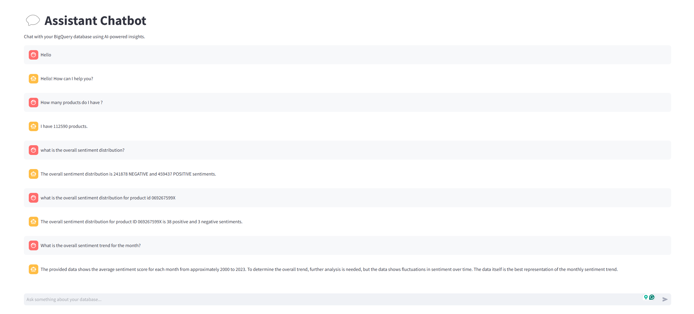

# AI Chat for Review Analysis & Insights

## Overview
This project is an AI-powered conversational agent that provides insights from a BigQuery database containing reviews, products, and sentiment data. The chatbot is built using LangChain, Google Gemini AI, and Streamlit, with an ETL pipeline for data processing and stored procedures to streamline queries.

## Tech Stack
- **Programming Language**: Python
- **Frameworks & Libraries**:
  - LangChain
  - Streamlit
  - SQLAlchemy
  - pandas
  - Google Cloud BigQuery
  - spaCy
  - Transformers (BERT-based NLP models)
- **Database**: Google BigQuery
- **Cloud Services**: Google Cloud Platform (GCP)
- **Containerization**: Docker
- **CI/CD**: GitHub Actions

## Project Structure
The repository consists of three main components:
1. **ETL Process**: Extracts, transforms, and loads Amazon review data into BigQuery.
2. **Stored Procedures**: Defines useful SQL procedures for querying sentiment trends and distributions.
3. **AI Agent**: Uses LangChain and Google Gemini AI to generate SQL queries and answer user queries based on the database.

## Features
- Natural language querying of a BigQuery database.
- Sentiment analysis and trends over time.
- Interactive chatbot UI using Streamlit.
- Preprocessing of Amazon review datasets using spaCy and Transformers.
- Automated data loading into BigQuery.
- Dockerized deployment.
- CI/CD pipeline with GitHub Actions for testing and pushing to Docker Hub.

## Setup & Installation
### Prerequisites
- Python 3.8+
- Google Cloud account with BigQuery access
- Docker installed
- GitHub Actions configured for CI/CD

### Installation Steps
1. **Clone the repository:**
   ```sh
   git clone <repo_url>
   cd <repo_name>
   ```
2. **Set up environment variables:**
   Create a `.env` file and add:
   ```env
   GOOGLE_APPLICATION_CREDENTIALS=<path_to_your_service_account_json>
   PROJECT_ID=<your_gcp_project_id>
   DATASET_ID=<your_bigquery_dataset_id>
   GOOGLE_API_KEY=<your_google_api_key>
   ```
3. **Install dependencies:**
   ```sh
   pip install -r requirements.txt
   ```
4. **Run the application locally:**
   ```sh
   streamlit run ai_agent.py
   ```
5. **Run tests:**
   ```sh
   pytest
   ```

## Docker & CI/CD
### Running with Docker
1. **Build the Docker image:**
   ```sh
   docker build -t ai-agent .
   ```
2. **Run the container:**
   ```sh
   docker run -p 8501:8501 --env-file .env ai-agent
   ```

### CI/CD with GitHub Actions
- The repository includes a GitHub Actions workflow for automated testing and deployment.
- The workflow tests the application and pushes the Docker image to a container registry upon successful completion.

## Usage
- Open the Streamlit UI and enter natural language queries related to product reviews and sentiments.
- The AI agent will generate and execute SQL queries to retrieve insights from the BigQuery database.
- Example queries:
  - "Show sentiment distribution for product X."
  - "What are the top-rated products in category Y?"
  - "How has sentiment changed over the past year?"


## Runtime Environment

Here is the runtime image showing the setup of the container for the application:




## License
This project is licensed under the MIT License.

